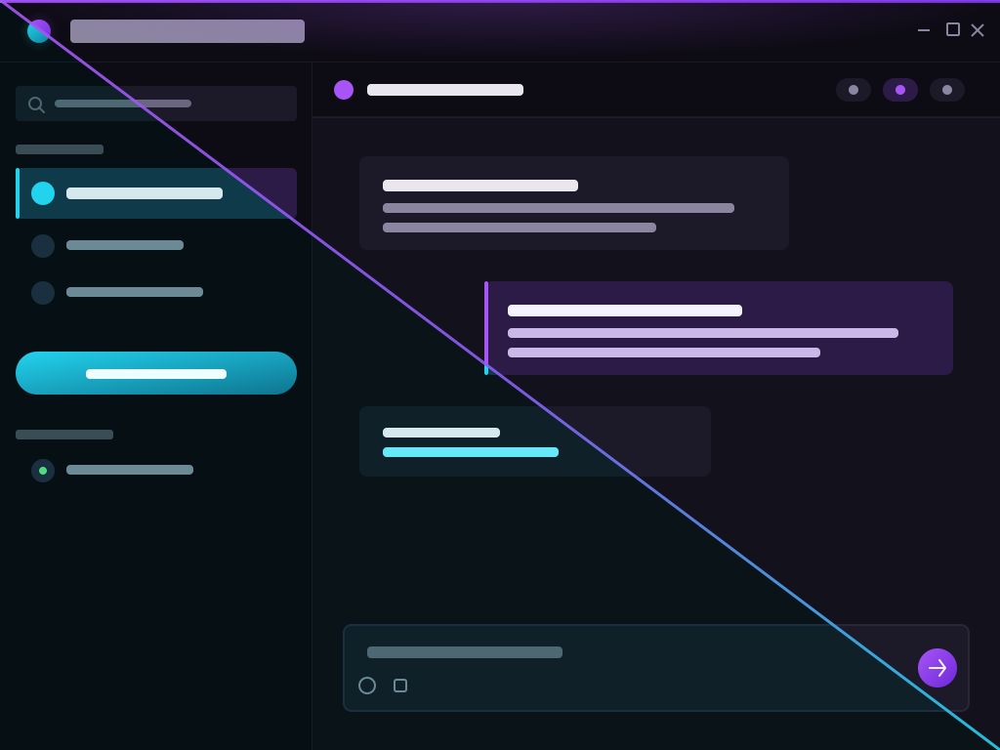
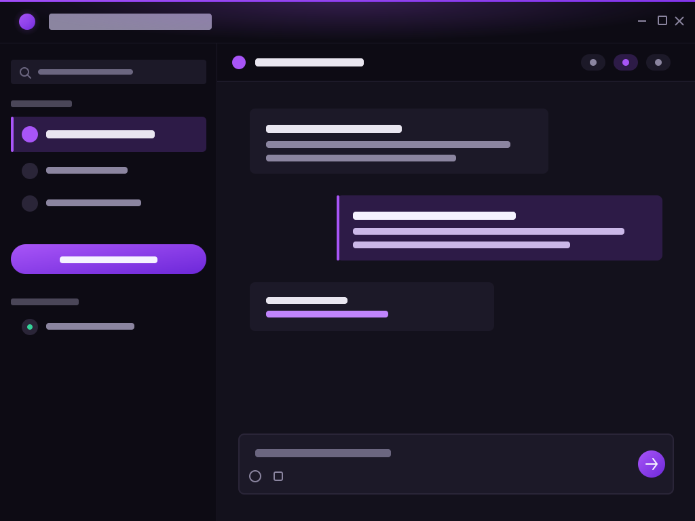
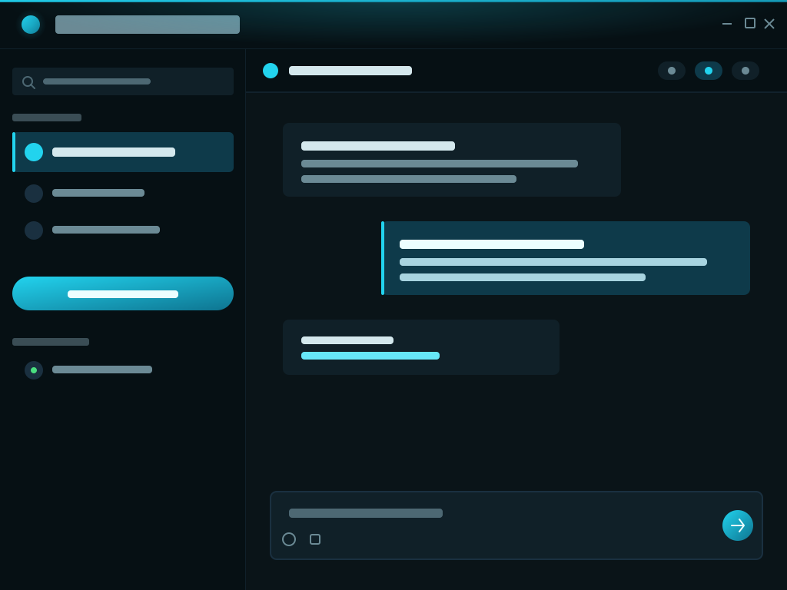

# TeamSpeak 6 // Rednelss Themes

Две тёмные темы для клиента **TeamSpeak 6**: глубокий фиолетовый **Midnight Violet** и прохладный бирюзовый **Abyss**.



---

## Темы

### 🌌 Midnight Violet
Глубокая аметистово-фиолетовая тема. Почти чёрный фиолетовый фон, акценты цвета аметиста, мягкая типографика.

| Элемент | Цвет |
|---|---|
| Основной фон | `#13111c` |
| Панели / сайдбар | `#0d0b14` |
| Карточки | `#1c1928` |
| Акцент | `#a855f7` |
| Акцент (hover) | `#c084fc` |
| Текст | `#e9e6f0` |



### 🌊 Abyss
Глубоководная тема. Почти чёрная бирюзовая база, холодные cyan-акценты, спокойный контраст.

| Элемент | Цвет |
|---|---|
| Основной фон | `#0a1418` |
| Панели / сайдбар | `#061014` |
| Карточки | `#102028` |
| Акцент | `#22d3ee` |
| Акцент (hover) | `#67e8f9` |
| Текст | `#d4e8ed` |



---

## Установка

1. Скачай репозиторий или только папку `ru.rednelss.themes` (зелёная кнопка **Code → Download ZIP**).
2. Помести папку `ru.rednelss.themes` в директорию расширений TeamSpeak 6:

   **Windows:**
```

%APPDATA%\TeamSpeak\Default\extensions\

```

**macOS:**
```

~/Library/Application Support/TeamSpeak/Default/extensions/

```

**Linux:**
```

~/.local/share/TeamSpeak/Default/extensions/

```

3. Полностью перезапусти клиент TeamSpeak 6 (не просто `Reload`, а закрыть и открыть заново).
4. Открой **Настройки → Внешний вид → Пользовательская тема** и выбери одну из тем:
- **Midnight Violet Theme**
- **Abyss Theme**

---

## Структура

```

ru.rednelss.themes/
├── package.json                  # манифест расширения
├── midnight-violet.css           # тема Midnight Violet
├── abyss.css                     # тема Abyss
├── preview-midnight-violet.svg   # превью для селектора тем
├── preview-abyss.svg             # превью для селектора тем
└── preview.svg                   # комбинированное превью расширения

```

---

## Как это работает

TeamSpeak 6 — это Electron-приложение (Chromium), поэтому темы — это обычные CSS-файлы, подключаемые клиентом.

Есть один неочевидный момент: **клиент объявляет свои CSS-переменные на селекторе `:root, ::before, ::after`**. Это значит, что псевдоэлементы (`::before` / `::after`), через которые TS6 рисует фоны панелей, хедеров и баннеров, читают переменные не от `:root`, а из этого комбинированного правила. Поэтому темы переопределяют переменные именно на том же селекторе:

```css
:root,
::before,
::after {
  --tsv-bg: #13111c !important;
  --tsv-tint: #a855f7 !important;
  /* ... */
}
```

Также добавлены точечные переопределения для мест, которые не читают `--tsv-*`: CodeMirror-редактор ввода чата, placeholder поиска, скроллбары, focus-ring.

---

## Кастомизация

Обе темы используют **единую структуру переменных**, поэтому их легко адаптировать под свой вкус. Открой CSS-файл и поменяй hex-значения в блоке `:root` в самом верху — там сгруппированы по смыслу:

- **Accent** — акцентный цвет
- **Surfaces** — фоны и поверхности
- **Typography** — цвета текста
- **Icons** — цвета иконок
- **Chat** — чат
- **Buttons** — кнопки
- **Controls** — слайдеры, тумблеры
- **Status / presence** — статусы

Например, чтобы сделать Midnight Violet кислотно-розовым, достаточно заменить `--tsv-tint` на `#ec4899`, а `--tsv-chat-self-bg` — на подходящий оттенок.

---

## Разработка

### Инспектор элементов

Чтобы исследовать реальные CSS-классы и переменные клиента:

**Windows:**

```
TeamSpeak.exe --remote-debugging-port=9988 --remote-allow-origins=*
```

**macOS:**

```
open TeamSpeak.app --args \
  --remote-debugging-port=9988 \
  --remote-allow-origins="*"
```

Затем открой в **Chromium-браузере** (`about://inspect/#devices`), добавь target `http://localhost:9988` и нажми **Inspect** на клиенте. Изменения в инспекторе — сессионные, для постоянных правь CSS-файлы.

### Добавление новой темы

1. Создай `my-theme.css` в корне папки.
2. Создай превью `preview-my-theme.svg` (рекомендуется 1024×768).
3. Добавь в `package.json` в массив `content.themes`:

```
{
  "name": "My Theme",
  "source": "my-theme.css",
  "image": "preview-my-theme.svg",
  "apiVersion": 1
}
```
4. Перезапусти клиент.

---

## Лицензия

[MIT](https://./LICENSE) — используй, форкай, изменяй, распространяй.

## Благодарности

- Вдохновлено рабочими темами сообщества TS6, в частности структурой переменных из [Gamer92000/teamspeak-theme-generator](https://github.com/Gamer92000/teamspeak-theme-generator).
- Официальная документация: [How to create a Custom theme for TeamSpeak 6](https://community.teamspeak.com/t/how-to-create-a-custom-theme-for-teamspeak-6/28018).
- Да и вообще ребятам из [TeamSpeak](https://teamspeak.com/) в целом респект.
